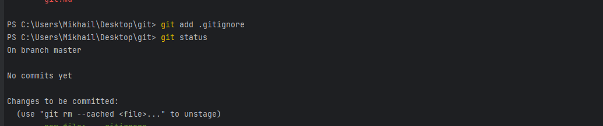

 ## 1. git init - инициализирует репозиторий

## 2. git add -это команда для добавления изменений в рабочей директории в индекс, чтобы они могли быть включены в следующий коммит.

## 3. git commit - это команда, которая:
   Cоздает новый коммит (зафиксированное изменение) на основе изменений, находящихся в индексе. 
   Команда git commit зафиксирует изменения, которые были добавлены в индекс с помощью команды git add, 
   и создаст новый коммит с сообщением описывающим изменения. После создания коммита, изменения сохраняются 
   в локальной истории версий репозитория Git.

## 4. git push - это команда, которая:
 Отправляет локальные изменения из локального репозитория в удаленный репозиторий. 
 Команда git push используется для обновления удаленного репозитория новыми коммитами из локального репозитория. 
 При выполнении команды git push, Git отправляет изменения в ветке, на которой в данный момент находится пользователь, на удаленный сервер. Если в удаленном репозитории уже есть изменения, необходимо выполнить git pull, чтобы сначала получить изменения из удаленного репозитория, а затем уже выполнить git push, чтобы отправить свои изменения.

## 5. git fetch/pull -  это команды, которые: 
### Позволяют получить изменения из удаленного репозитория в локальный репозиторий.
Команда git fetch используется для получения изменений из удаленного репозитория, но не для их 
объединения с локальными изменениями, в отличие от команды git pull.
В этом случае нужно выполнить слияние изменений вручную с помощью команды git merge.

Команда git pull включает в себя команду git fetch, а затем автоматически объединяет полученные изменения из 
удаленной ветки в локальную ветку. Это удобно, когда требуется получить изменения из удаленного репозитория и применить
их к локальным файлам сразу.

## 6. git reset - команда, которая:

Используется для отмены изменений в локальном репозитории. 
Она может использоваться для сброса коммитов, изменения состояния файлов и переноса изменений между ветками.

Пример: отмена последнего коммита и возврат изменений в рабочую директорию:

## 7. git branch - это команда, которая:
Используется для создания, просмотра, удаления или переключения веток.

Вот несколько примеров использования этой команды:
### Просмотр всех веток:

### Создание новой ветки:
    git branch new_branch_name

### Переключение на другую ветку:
    git checkout branch_name

### Удаление ветки:
    git branch -d branch_name

### Переименование ветки:
    git branch -m old_branch_name new_branch_name

## 8. Что такое конфликты и почему они появляются, как их решать
Конфликты в Git - это ситуации, когда разные версии одного и того же файла или набора файлов встречаются в разных ветках, 
и Git не может автоматически определить, какую версию сохранить. Это может произойти, когда две или более ветки вносят изменения 
в один и тот же файл в разных местах или в одном и том же месте.

### Конфликты могут быть вызваны следующими причинами:

- Изменения в одном файле в двух разных ветках Git
- Изменения в одной строке кода в двух разных ветках Git
- Удаление файла в одной ветке и изменения в другой
### Чтобы разрешить конфликты в Git, необходимо использовать команду git mergetool или выполнять процесс вручную. 
Вот общий процесс разрешения конфликтов:

- Использовать команду git status, чтобы определить, какие файлы находятся в состоянии конфликта.
- Открыть каждый файл с конфликтом и найдите раздел, который содержит маркеры конфликта <<<<<<<, ======= и >>>>>>>.
- Решить конфликты, удалив маркеры конфликта и выбрав нужную версию для каждой строки. Если нужно, можно использовать инструменты слияния, такие как git mergetool, чтобы упростить процесс.

- Сохранить изменения и закрыть файл.

- Использовать команду git add для добавления изменений в индекс Git.

- Использовать команду git commit для создания нового коммита, разрешающего конфликт.

- Если есть удаленная ветка, на которую вы пытаетесь отправить свои изменения, используйте команду git push для отправки изменений на удаленный репозиторий.

- Важно отметить, что в процессе разрешения конфликтов необходимо быть осторожным и следить за изменениями в файлах, чтобы не удалить или переписать важные данные. 
Также стоит обновляться перед внесением изменений в репозиторий, чтобы уменьшить вероятность конфликтов.
        

## 9.cherry-pick - это команда, которая:
Позволяет выбрать определенный коммит из одной ветки и применить его к другой ветке. Это может быть полезным, когда необходимо внести определенное изменение, внесенное в одной ветке, в другую ветку, не перенося всех изменений, внесенных в первую ветку.

